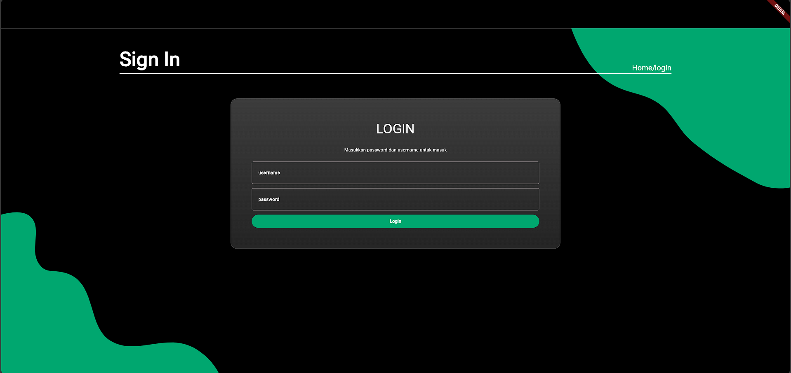
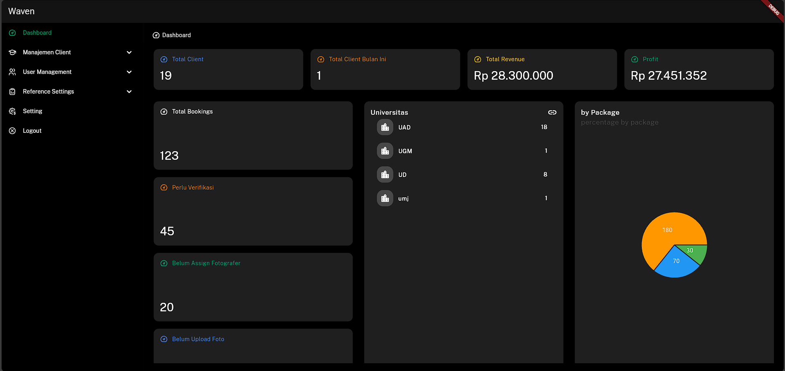
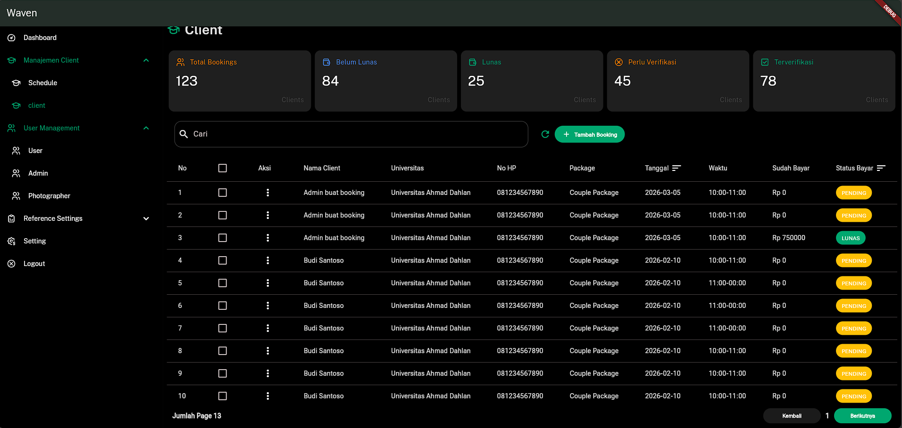
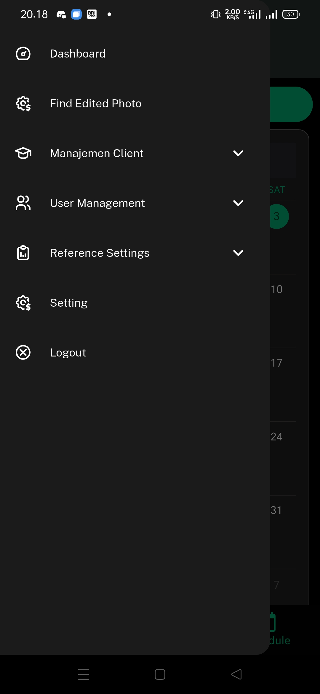
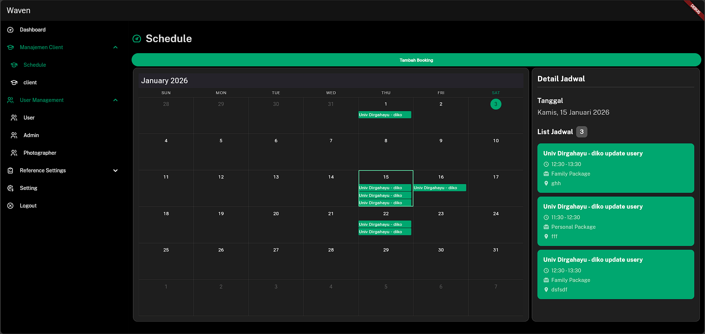
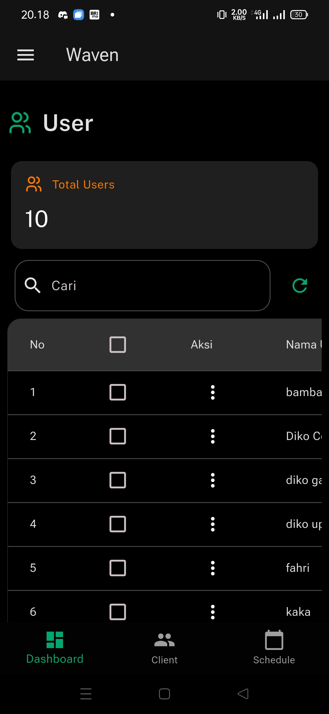

# 🌊 WavenAdmin

**WavenAdmin** adalah aplikasi admin dashboard berbasis Flutter untuk mengelola sistem booking, paket, addon, universitas, dan user management. Dibangun dengan clean architecture dan state management modern untuk performa optimal dan maintainability yang baik.


---

## 📋 Daftar Isi

- [Fitur Utama](#-fitur-utama)
- [Screenshots](#-screenshots)
- [Teknologi & Dependencies](#-teknologi--dependencies)
- [Arsitektur Project](#-arsitektur-project)
- [Prasyarat](#-prasyarat)
- [Instalasi](#-instalasi)
- [Konfigurasi Environment](#-konfigurasi-environment)
- [Menjalankan Aplikasi](#-menjalankan-aplikasi)
- [Testing](#-testing)
- [Struktur Folder](#-struktur-folder)
- [Clean Architecture](#-clean-architecture)
- [State Management](#-state-management)
- [Troubleshooting](#-troubleshooting)
- [Kontribusi](#-kontribusi)

---

## ✨ Fitur Utama

### 🔐 Authentication
- Login/Logout dengan JWT authentication
- Secure token storage menggunakan `flutter_secure_storage`
- Auto refresh token management
- Session handling

### 📦 Addon Management
- ✅ Create, Read, Update, Delete addons
- ✅ List dengan pagination
- ✅ Detail addon dengan statistik
- ✅ Toggle active/inactive status
- ✅ Price management

### 📚 Booking Management
- View dan manage booking list
- Filter berdasarkan status
- Booking detail information
- Calendar view untuk jadwal booking
- 💳 **Integrasi Midtrans** untuk pembayaran booking
- 🔗 **Deep Linking** untuk akses langsung ke detail booking dari notifikasi/link eksternal

### 🎓 University Management
- CRUD operations untuk data universitas
- Search dan filter universitas
- Detail informasi universitas

### 📦 Package Management
- Manage paket layanan
- Pricing configuration
- Package availability settings

### 👥 User Management
- User list dan detail
- Role management
- User activity tracking

### � File Mover (Multi-Platform)
- **Android & Windows support** untuk bulk file transfer
- Smart folder navigation dengan file picker
- Preview file sebelum dipindahkan
- Automatic fallback dari rename ke copy operation
- Scoped storage compliance untuk Android 10+
- History tracking untuk semua file operations
- Error handling dengan detailed reporting

### �📊 Dashboard & Analytics
- Visual charts menggunakan `fl_chart`
- Real-time statistics
- Interactive calendar dengan `syncfusion_flutter_calendar`
- Performance metrics

---

## 📸 Screenshots

### 🎥 Demo Video

#### File Mover Feature (Android & Windows)


**Fitur:**
- Bulk file transfer dengan preview
- Support multiple file extensions (.jpg, .JPG, .ARW)
- Real-time status monitoring
- History tracking
- Error handling

---

#### Payment Gateway Integration (Midtrans)


**Fitur:**
- Midtrans payment integration
- Real-time transaction tracking
- Payment verification
- Deep linking support untuk payment callback

---

### 📱 App Screenshots

#### Authentication & Login


#### Dashboard


#### Booking Management


#### Menu Navigation


#### Schedule / Calendar


#### User Management


---

## 🛠️ Teknologi & Dependencies

### Core Framework
- **Flutter SDK**: `^3.10.0`
- **Dart**: `^3.10.0`

### State Management & Dependency Injection
- **flutter_bloc**: `^9.1.1` - BLoC pattern untuk state management
- **flutter_riverpod**: `^3.0.3` - Alternative state management
- **riverpod_annotation**: `^3.0.3` - Code generation untuk Riverpod
- **get_it**: `^9.2.0` - Service locator untuk dependency injection
- **equatable**: `^2.0.7` - Value equality untuk state objects

### Navigation & Routing
- **go_router**: `^17.0.1` - Declarative routing

### Network & API
- **dio**: `^5.9.0` - HTTP client dengan interceptors
- **http**: `^1.6.0` - Alternative HTTP client
- **json_annotation**: `^4.9.0` - JSON serialization annotations
- **json_serializable**: `^6.11.2` - JSON code generation

### UI Components & Styling
- **google_fonts**: `^6.3.3` - Custom typography
- **flutter_svg**: `^2.2.3` - SVG rendering
- **lottie**: `^3.3.2` - Lottie animations
- **cached_network_image**: `^3.4.1` - Image caching

### Charts & Calendar
- **fl_chart**: `^0.69.0` - Beautiful charts
- **table_calendar**: `^3.2.0` - Calendar widget
- **syncfusion_flutter_calendar**: `^31.2.18` - Advanced calendar

### Storage & Security
- **flutter_secure_storage**: `^10.0.0` - Secure token storage
- **path_provider**: `^2.1.5` - Access to file system

### Utilities
- **logger**: `^2.6.2` - Logging utility
- **intl**: `^0.20.1` - Internationalization
- **path**: `^1.9.1` - Path manipulation
- **url_launcher**: `^6.3.2` - Launch URLs
- **app_links**: `^6.3.3` - Deep linking

### File & Media
- **file_picker**: `^10.3.7` - File selection untuk File Mover
- **image_picker**: `^1.2.1` - Image selection
- **permission_handler**: `^12.0.1` - Permission management
- **device_info_plus**: `^9.1.2` - Device info untuk Android version detection

### Dev Dependencies
- **flutter_test**: Testing framework
- **flutter_lints**: `^6.0.0` - Linting rules
- **mockito**: `^5.4.4` - Mocking framework
- **mocktail**: `^1.0.4` - Alternative mocking
- **build_runner**: `^2.10.4` - Code generation
- **riverpod_generator**: `^3.0.3` - Riverpod code generation

---

## 🏗️ Arsitektur Project

Project ini menggunakan **Clean Architecture** dengan 3 layer utama:

```
┌─────────────────────────────────────┐
│       Presentation Layer            │
│  (Pages, Widgets, Cubits, Riverpod) │
└──────────────┬──────────────────────┘
               │
┌──────────────▼──────────────────────┐
│         Domain Layer                │
│   (Entities, UseCases, Repositories)│
└──────────────┬──────────────────────┘
               │
┌──────────────▼──────────────────────┐
│          Data Layer                 │
│ (Models, DataSources, Repositories) │
└─────────────────────────────────────┘
```

### Keuntungan Clean Architecture:
✅ **Separation of Concerns** - Setiap layer punya tanggung jawab jelas  
✅ **Testability** - Mudah untuk unit testing  
✅ **Maintainability** - Mudah di-maintain dan dikembangkan  
✅ **Scalability** - Mudah menambah fitur baru  
✅ **Independence** - Domain layer tidak tergantung pada framework

---

## 📋 Prasyarat

Sebelum memulai, pastikan Anda sudah menginstall:

- ✅ **Flutter SDK** (>= 3.10.0) - [Download](https://flutter.dev)
- ✅ **Dart SDK** (>= 3.10.0) - Bundled dengan Flutter
- ✅ **Android Studio** / **VS Code** dengan Flutter extension
- ✅ **Git** - Version control
- ✅ **Android SDK** (untuk development Android)
- ✅ **Xcode** (untuk development iOS - MacOS only)

### Verifikasi Instalasi

```bash
flutter doctor -v
```

Pastikan semua checkmark (✓) hijau.

---

## 🚀 Instalasi

### 1. Clone Repository

```bash
git clone <repository-url>
cd wavenadmin
```

### 2. Install Dependencies

```bash
flutter pub get
```

### 3. Generate Code (JSON Serialization & Riverpod)

```bash
flutter pub run build_runner build --delete-conflicting-outputs
```

Untuk development dengan auto-rebuild:

```bash
flutter pub run build_runner watch --delete-conflicting-outputs
```

### 4. Setup Environment Configuration

Buat file konfigurasi environment (lihat section [Konfigurasi Environment](#-konfigurasi-environment))

---

## ⚙️ Konfigurasi Environment

Project ini menggunakan `EnvironmentConfig` untuk mengelola environment variables.

### File: `lib/common/constant.dart`

```dart
class EnvironmentConfig {
  // API Configuration
  static const String apiBaseUrl = 'https://api.yourdomain.com/';
  static const int apiTimeout = 30000; // milliseconds
  
  // Environment
  static const String environment = 'development'; // development, staging, production
  
  // Feature Flags
  static const bool enableLogging = true;
  static const bool enableDebugMode = true;
}
```

### Environment Options:
- **`development`** - Untuk development lokal
- **`staging`** - Untuk testing di staging server
- **`production`** - Untuk production release

### Best Practices:
1. ❌ **JANGAN** commit API keys atau secrets ke Git
2. ✅ Gunakan file `.env` atau `dart-define` untuk sensitive data
3. ✅ Gunakan environment-specific configuration files

### Menggunakan dart-define (Recommended):

```bash
flutter run --dart-define=API_BASE_URL=https://api.example.com/ --dart-define=ENVIRONMENT=production
```

---

## 🏃 Menjalankan Aplikasi

### Development Mode

```bash
# Run di emulator/device yang tersedia
flutter run

# Run di device spesifik
flutter run -d <device-id>

# Run dengan hot reload
flutter run --hot
```

### Debug Mode (dengan logging)

```bash
flutter run --debug
```

### Release Mode

```bash
# Android APK
flutter build apk --release

# Android App Bundle (untuk Play Store)
flutter build appbundle --release

# iOS (MacOS only)
flutter build ios --release

# Web
flutter build web --release

# Windows
flutter build windows --release
```

### List Available Devices

```bash
flutter devices
```

---

## 🧪 Testing

Project ini memiliki **42 passing tests** dengan coverage untuk:
- ✅ Authentication flow
- ✅ Addon CRUD operations
- ✅ Data sources & repositories
- ✅ Models & serialization
- ✅ Use cases
- ✅ Environment configuration

### Run All Tests

```bash
flutter test
```

### Run Tests dengan Coverage

```bash
flutter test --coverage
```

### Run Specific Test File

```bash
flutter test test/data/datasource/addon_remote_data_source_test.dart
```

### Run Tests dengan Verbose Output

```bash
flutter test --reporter expanded
```

### View Coverage Report

```bash
# Generate HTML coverage report (requires lcov)
genhtml coverage/lcov.info -o coverage/html
open coverage/html/index.html
```

### Test Structure

Semua test menggunakan **AAA Pattern**:
```dart
test('should return data when API call is successful', () async {
  // Arrange - Setup test data dan mocks
  when(() => mockDataSource.getData()).thenAnswer((_) async => testData);
  
  // Act - Execute function yang di-test
  final result = await repository.getData();
  
  // Assert - Verify hasil
  expect(result, testData);
  verify(() => mockDataSource.getData()).called(1);
});
```

📚 **Dokumentasi Testing Lengkap**: Lihat [test/README.md](test/README.md)  
📊 **Test Summary**: Lihat [TEST_SUMMARY.md](TEST_SUMMARY.md)

---

## 📁 Struktur Folder

```
wavenadmin/
├── android/                 # Android native code
├── ios/                     # iOS native code
├── web/                     # Web build files
├── windows/                 # Windows native code
├── linux/                   # Linux native code
├── macos/                   # MacOS native code
├── assets/                  # Asset files
│   ├── icon/               # Icons & images
│   │   ├── content/
│   │   └── sidenavigation/
│   └── lottie/             # Lottie animations
├── lib/                     # Main source code
│   ├── common/             # Common utilities & constants
│   │   ├── color.dart      # Color palette
│   │   ├── constant.dart   # Environment config & constants
│   │   ├── theme.dart      # App theme configuration
│   │   ├── icon.dart       # Icon paths
│   │   ├── lottie.dart     # Lottie animation paths
│   │   ├── util.dart       # Utility functions
│   │   └── dummy.dart      # Dummy data for testing
│   │
│   ├── data/               # Data Layer (Clean Architecture)
│   │   ├── datasource/     # Remote & Local data sources
│   │   │   ├── addon_remote_data_source.dart
│   │   │   ├── auth_remote_data_source.dart
│   │   │   ├── booking_remote_data_source.dart
│   │   │   ├── package_remote_data_source.dart
│   │   │   ├── university_remote_data_source.dart
│   │   │   ├── user_remote_data_source.dart
│   │   │   └── local_data.dart
│   │   │
│   │   ├── model/          # Data models with JSON serialization
│   │   │   ├── addon_detail_model.dart
│   │   │   ├── list_addons_model.dart
│   │   │   └── ...
│   │   │
│   │   └── *_repository_impl.dart  # Repository implementations
│   │
│   ├── domain/             # Domain Layer (Business Logic)
│   │   ├── entity/         # Business entities (Plain Dart objects)
│   │   ├── repository/     # Repository interfaces
│   │   └── usecase/        # Business use cases
│   │       ├── create_addon.dart
│   │       ├── delete_addon.dart
│   │       └── ...
│   │
│   ├── presentation/       # Presentation Layer (UI)
│   │   ├── pages/          # Page screens
│   │   │   ├── addon_reference_page.dart
│   │   │   ├── login_page.dart
│   │   │   ├── dashboard_page.dart
│   │   │   └── ...
│   │   │
│   │   ├── widget/         # Reusable widgets
│   │   │   ├── custom_button.dart
│   │   │   ├── custom_textfield.dart
│   │   │   └── ...
│   │   │
│   │   ├── cubit/          # BLoC/Cubit state management
│   │   │   └── ...
│   │   │
│   │   ├── riverpod/       # Riverpod providers & notifiers
│   │   │   └── notifier/
│   │   │
│   │   └── route/          # Navigation & routing
│   │       └── app_router.dart
│   │
│   ├── injection.dart      # Dependency Injection setup (GetIt)
│   └── main.dart           # App entry point
│
├── test/                    # Test files (mirrors lib structure)
│   ├── common/             # Common layer tests
│   ├── data/               # Data layer tests
│   │   ├── datasource/
│   │   ├── model/
│   │   └── repository/
│   ├── domain/             # Domain layer tests
│   │   └── usecase/
│   ├── README.md           # Test documentation
│   └── ...
│
├── coverage/               # Test coverage reports
├── build/                  # Build artifacts
├── pubspec.yaml            # Dependencies & configuration
├── analysis_options.yaml   # Linting rules
├── README.md               # This file
└── TEST_SUMMARY.md         # Test achievement summary
```

---

## 🏛️ Clean Architecture

### Layer 1: Presentation Layer (`lib/presentation/`)

**Tanggung Jawab**: UI, user interaction, state management

**Components**:
- **Pages**: Full screen widgets
- **Widgets**: Reusable UI components
- **Cubits/Notifiers**: State management logic
- **Routes**: Navigation configuration

**Rules**:
- ✅ Depend on Domain Layer (UseCases & Entities)
- ❌ TIDAK boleh depend pada Data Layer
- ✅ Hanya handle UI logic dan state

### Layer 2: Domain Layer (`lib/domain/`)

**Tanggung Jawab**: Business logic, use cases, interfaces

**Components**:
- **Entities**: Pure business objects (no JSON, no framework)
- **Repositories**: Abstract interfaces
- **UseCases**: Single responsibility business operations

**Rules**:
- ✅ Pure Dart code (no Flutter dependencies)
- ❌ TIDAK depend pada framework
- ✅ Paling independent layer

**Example UseCase**:
```dart
class CreateAddon {
  final AddonsRepository repository;
  
  CreateAddon(this.repository);
  
  Future<String> execute(CreateAddonRequest request) async {
    return repository.createAddon(request);
  }
}
```

### Layer 3: Data Layer (`lib/data/`)

**Tanggung Jawab**: Data fetching, caching, transformation

**Components**:
- **Models**: Data models dengan JSON serialization
- **DataSources**: Remote API & Local storage
- **Repository Implementations**: Implement domain interfaces

**Rules**:
- ✅ Implement Repository interfaces dari Domain
- ✅ Transform Models → Entities
- ✅ Handle data operations (API calls, caching, etc.)

**Example Repository**:
```dart
class AddonsRepositoryImpl implements AddonsRepository {
  final AddonRemoteDataSource remoteDataSource;
  
  @override
  Future<ListAddons> getListAddons(int page, int limit) async {
    final response = await remoteDataSource.getListAddons(page, limit);
    return response.toEntity(); // Model → Entity
  }
}
```

---

## 🎯 State Management

Project ini menggunakan **2 state management solutions**:

### 1. BLoC/Cubit (flutter_bloc)

Untuk complex state dengan event-driven architecture.

**Usage**:
```dart
// Cubit
class AddonCubit extends Cubit<AddonState> {
  final CreateAddon createAddonUseCase;
  
  Future<void> createAddon(String title, int price) async {
    emit(AddonLoading());
    try {
      final result = await createAddonUseCase.execute(
        CreateAddonRequest(title: title, price: price)
      );
      emit(AddonSuccess(result));
    } catch (e) {
      emit(AddonError(e.toString()));
    }
  }
}

// In Widget
BlocConsumer<AddonCubit, AddonState>(
  listener: (context, state) {
    if (state is AddonSuccess) {
      ScaffoldMessenger.of(context).showSnackBar(
        SnackBar(content: Text(state.message)),
      );
    }
  },
  builder: (context, state) {
    if (state is AddonLoading) return CircularProgressIndicator();
    // ... other states
  },
)
```

### 2. Riverpod (flutter_riverpod)

Untuk simpler state dan dependency injection.

**Usage**:
```dart
// Provider
final addonListProvider = FutureProvider<ListAddons>((ref) async {
  final repository = ref.watch(addonRepositoryProvider);
  return repository.getListAddons(1, 10);
});

// In Widget
class AddonListPage extends ConsumerWidget {
  @override
  Widget build(BuildContext context, WidgetRef ref) {
    final addonList = ref.watch(addonListProvider);
    
    return addonList.when(
      data: (addons) => ListView.builder(...),
      loading: () => CircularProgressIndicator(),
      error: (err, stack) => Text('Error: $err'),
    );
  }
}
```

---

## 🐛 Troubleshooting

### Issue: Build Runner Conflicts

**Error**: `Conflicting outputs were detected`

**Solution**:
```bash
flutter pub run build_runner build --delete-conflicting-outputs
```

### Issue: Dependency Version Conflict

**Solution**:
```bash
flutter pub upgrade --major-versions
flutter pub get
```

### Issue: Missing Generated Files

**Error**: `*.g.dart` files not found

**Solution**:
```bash
flutter pub run build_runner build --delete-conflicting-outputs
```

### Issue: Secure Storage Error (Android)

**Error**: `MissingPluginException`

**Solution**:
1. Update `android/app/build.gradle`:
```gradle
android {
    compileSdkVersion 33
    minSdkVersion 18
}
```

2. Rebuild:
```bash
flutter clean
flutter pub get
flutter run
```

### Issue: Network Connection Error

**Solution**:
1. Check `EnvironmentConfig.apiBaseUrl` di `lib/common/constant.dart`
2. Pastikan API server running
3. Check internet permission di `AndroidManifest.xml`:
```xml
<uses-permission android:name="android.permission.INTERNET"/>
```

### Issue: JWT Token Expired

**Solution**: Implement auto refresh token mechanism di dio interceptor atau logout dan login kembali.

### Issue: File Mover - Permission Denied (Android 10+)

**Error**: `PathAccessException: Cannot copy file to '/storage/emulated/0/...'`

**Penyebab**: Scoped Storage restrictions di Android 10+

**Solution**:
1. Ensure permissions di `AndroidManifest.xml`:
```xml
<uses-permission android:name="android.permission.MANAGE_EXTERNAL_STORAGE" />
<uses-permission android:name="android.permission.READ_EXTERNAL_STORAGE" />
<uses-permission android:name="android.permission.WRITE_EXTERNAL_STORAGE" />
```

2. Request permission saat runtime (automatic di code)

3. Gunakan SAF (Storage Access Framework) - code sudah handle dengan file_picker

4. Untuk testing, gunakan Documents/Download folder

### Issue: File Mover - File Not Found

**Error**: File yang dicari tidak ada di folder sumber

**Solution**:
1. Verify path folder sumber (use file picker, jangan manual input)
2. Check file extension (.jpg, .JPG, .ARW)
3. Lihat preview dialog untuk confirm file availability
4. Check file permissions - file harus readable

---

## 🤝 Kontribusi

### Git Workflow

1. **Create Feature Branch**
```bash
git checkout -b feature/nama-fitur
```

2. **Make Changes & Commit**
```bash
git add .
git commit -m "feat: add new feature description"
```

3. **Push Branch**
```bash
git push origin feature/nama-fitur
```

4. **Create Pull Request**

### Commit Message Convention

Gunakan conventional commits:
- `feat:` - Fitur baru
- `fix:` - Bug fix
- `docs:` - Dokumentasi
- `style:` - Formatting, missing semi colons, etc
- `refactor:` - Code refactoring
- `test:` - Menambah/update tests
- `chore:` - Maintenance tasks

**Example**:
```bash
git commit -m "feat: add delete addon functionality"
git commit -m "fix: resolve login token issue"
git commit -m "docs: update README installation steps"
```

### Code Review Checklist

Before submitting PR:
- ✅ All tests passing (`flutter test`)
- ✅ No linting errors (`flutter analyze`)
- ✅ Code formatted (`flutter format .`)
- ✅ Documentation updated
- ✅ Screenshots added (jika ada UI changes)

---

## 📝 Additional Resources

### Documentation
- 📚 [Flutter Documentation](https://docs.flutter.dev/)
- 🎨 [Material Design Guidelines](https://material.io/design)
- 🏗️ [Clean Architecture](https://blog.cleancoder.com/uncle-bob/2012/08/13/the-clean-architecture.html)
- 🔵 [BLoC Pattern](https://bloclibrary.dev/)
- 🟢 [Riverpod Documentation](https://riverpod.dev/)

### Learning Resources
- [Flutter Codelabs](https://docs.flutter.dev/codelabs)
- [Dart Language Tour](https://dart.dev/guides/language/language-tour)
- [Flutter YouTube Channel](https://www.youtube.com/c/flutterdev)

---

## 📄 License

This project is private and proprietary. All rights reserved.

---

## 👥 Team

**Development Team**: WavenAdmin Development Team

**Contact**: 
- Email: support@wavenadmin.com
- Website: https://wavenadmin.com

---

## 🎉 Acknowledgments

Terima kasih kepada:
- Flutter team untuk amazing framework
- Semua contributors open source packages yang digunakan
- Community Flutter Indonesia

---

<div align="center">

**Built with ❤️ using Flutter**

⭐ Star this repo if you find it helpful!

[Report Bug](https://github.com/yourrepo/issues) · [Request Feature](https://github.com/yourrepo/issues)

</div>
